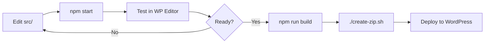

# 🧱 Twork Builder

> **Professional WordPress Gutenberg Blocks Plugin** — purpose-built for the Twork Ecosystem  
> Enterprise-grade page building blocks for hospitals, clinics, corporate sites, food & retail brands, and e-commerce.

[](LICENSE)
[](https://wordpress.org/)
[](https://php.net/)
[](https://nodejs.org/)
[](https://developer.wordpress.org/block-editor/)
[](#-block-catalog)

**Current Version:** `1.0.13` · **270+ Custom Blocks** · **GPL v2 or later**

🔗 **Repository:** [github.com/tworksystem/twork-builder](https://github.com/tworksystem/twork-builder)

---

## 📋 Table of Contents

- [Overview](#-overview)
- [What's New in v1.0.13](#-whats-new-in-v1013)
- [Key Features](#-key-features)
- [Requirements](#-requirements)
- [Quick Start](#-quick-start)
- [Project Structure](#-project-structure)
- [Block Catalog](#-block-catalog)
- [Department Page Suites](#-department-page-suites)
- [Brand & Shop Blocks](#-brand--shop-blocks)
- [Site Template Kits](#-site-template-kits)
- [Patient Guide Blocks](#-patient-guide-blocks)
- [Shweghee Reference Site](#-shweghee-reference-site)
- [Available Scripts](#️-available-scripts)
- [Development Workflow](#-development-workflow)
- [Sync Pipeline & SKIP_BLOCKS](#-sync-pipeline--skip_blocks)
- [Block Architecture](#️-block-architecture)
- [PHP Render Callbacks](#-php-render-callbacks)
- [Frontend Assets](#-frontend-assets)
- [Security](#-security)
- [Build & Deployment](#-build--deployment)
- [Troubleshooting](#-troubleshooting)
- [Contributing](#-contributing)
- [Commit Convention](#-commit-convention)
- [License & Support](#-license--support)

---

## 🌟 Overview

**Twork Builder** is a production-ready WordPress plugin that delivers **270+ custom Gutenberg blocks** for building modern, responsive websites within the Twork Ecosystem. It powers hospital portals, specialty department pages, corporate marketing sites, pharmacy shops, CSR pages, food & retail brand sites, and booking flows — all editable through the native WordPress Block Editor.

Built with **ES6+**, **SCSS**, **@wordpress/scripts**, and **WordPress best practices**, the plugin is designed for:

- 🏥 **Healthcare & hospital websites** — departments, doctors, endoscopy, laparoscopy, neuro, radiology, physio, patient guides
- 🥑 **Agrezer / Avocado brand sites** — hero sections, stats, testimonials, shop grids
- 🧈 **Food & retail brand sites** — Shweghee-style home pages with carousels, categories, and reviews
- 🛒 **WooCommerce integration** — shop headers, product grids, carousels, detail pages, pharmacy blocks
- 🏢 **Corporate & CSR pages** — mission/vision, awards, events, initiatives
- 📅 **Booking & contact flows** — form picker integration (CF7, Formidable, WPForms, Fluent) + AJAX contact
- 📱 **Fully responsive layouts** — mobile-first SCSS with editor/frontend parity

---

## 🆕 What's New in v1.0.13

| Area | Highlights |
| --- | --- |
| 🔬 **Endoscopy Suite** | Hero, stats, procedures spotlight, prep tabs, journey steps, technology, FAQ, testimonials, team |
| 🩺 **Laparoscopy Wave 1** | Teal token system, hero, stats, procedures, technology — endo-parity architecture |
| 🏪 **Brand & Shop Blocks** | Header, footer, carousels, product grids, reviews, subscribe bar, split promo |
| 📦 **Site Template Kits** | Apply Template 1–5 from WP Admin → auto-create pages with pre-built block stacks |
| 📅 **Booking Layout** | Hero + multi-column booking info cards with third-party form picker |
| ✉️ **Contact Form AJAX** | Honeypot, rate-limit, `wp_mail` — no extra plugin required for basic contact |
| 🍽️ **About Staff Meal** | Gallery, feedback carousel, milestones — hospital culture pages |
| ⚡ **Init Script Guards** | Idempotent front-end initializers across 40+ `assets/js/*-init.js` scripts |

---

## ✨ Key Features

| Feature | Description |
| --- | --- |
| 🎨 **270+ Custom Blocks** | Pre-built sections, cards, grids, heroes, FAQs, timelines, department suites, and more |
| 🏪 **Brand Page Suite** | Industry-agnostic header, carousels, grids, FAQ, newsletter, and footer blocks |
| 🏥 **Department Suites** | Endoscopy, laparoscopy, neuro, radiology, physio, emergency — cohesive design tokens per specialty |
| 🏥 **Patient Guide Suite** | Visiting hours, visitor guidelines (Do's & Don'ts) |
| 📦 **Site Template Kits** | One-click page stacks for rapid site launches |
| 🧪 **Static-to-Block QA** | `shweghee/` reference site for visual parity before WordPress migration |
| 🚀 **Modern Dev Stack** | ES6+, SCSS, Webpack via `@wordpress/scripts` |
| 📦 **Production Builds** | Minified bundles, PHP copy to `build/`, plugin ZIP generator (under 2 MB target) |
| 🔧 **Developer Tooling** | Sync scripts, style import patching, block recovery, scaffold utilities |
| 📱 **Responsive by Default** | Mobile-first SCSS with fluid spacing and breakpoint-aware layouts |
| ⚡ **Performance Focused** | Conditional script enqueue, scoped block styles, critical CSS for stats sections |
| 🧩 **Dynamic PHP Blocks** | Server-side render callbacks for blog, shop, updates, WooCommerce, and CPT-driven content |
| 🎯 **Editor Experience** | Dedicated block category, inspector controls, editor-only styles, performance helpers |
| 🗂️ **Deprecated Block Support** | Legacy blocks preserved under `src/deprecated/` for safe migration |
| 🔒 **Security Hardened** | Nonces, capability checks, honeypot, rate limiting, output escaping at render |

---

## 📦 Requirements

| Dependency | Minimum Version |
| --- | --- |
| **WordPress** | 6.0+ |
| **PHP** | 7.4+ |
| **Node.js** | 18.0+ |
| **npm** | 9.0+ |

**Optional integrations:**

- 🛒 **WooCommerce** — required for pharmacy, shop grid, product detail, and carousel blocks
- 📋 **Contact Form 7 / Formidable / WPForms / Fluent Forms** — optional; booking layout form picker
- 📰 **Custom Post Types** — Awards, CSR Initiatives, Emergency Units (included in plugin)

---

## 🚀 Quick Start

### 1️⃣ Clone the Repository

```bash
git clone https://github.com/tworksystem/twork-builder.git
cd twork-builder
```

### 2️⃣ Install Dependencies

```bash
npm install
```

### 3️⃣ Development Mode (Watch)

```bash
npm start
```

Starts the development build with **hot reload** — recompiles automatically on file changes in `src/`.

> 💡 `npm start` runs `sync-src-from-mk.py` and `patch-style-imports.py` before Webpack. Hand-written blocks in `SKIP_BLOCKS` are never overwritten.

### 4️⃣ Production Build

```bash
npm run build
```

Builds minified, optimized assets into `build/`. Uses **8 GB Node heap** by default to handle the large block set.

> 💡 **Out of memory?**
>
> ```bash
> NODE_OPTIONS=--max-old-space-size=8192 npm run build
> ```

### 5️⃣ Create Plugin ZIP

```bash
./create-zip.sh
```

Generates `twork-builder-{version}.zip` in the project root — ready for WordPress upload (under 2 MB target).

### 6️⃣ Install in WordPress

**Via Admin Dashboard:**

`Plugins → Add New → Upload Plugin → twork-builder-1.0.13.zip → Activate`

**Via WP-CLI:**

```bash
wp plugin install twork-builder-1.0.13.zip --activate
```

### 7️⃣ Apply a Site Template Kit (Optional)

`WP Admin → Twork Templates → Select Kit 1–5 → Apply`

Creates pages with pre-composed block stacks for rapid launches.

---

## 📁 Project Structure

```
twork-builder/
├── 📂 src/                          # Block source (ES6, SCSS, block.json) — 270+ folders
│   ├── endo-*/                      # Endoscopy department suite
│   ├── laparo-*/                    # Laparoscopy department suite (Wave 1)
│   ├── brand-*/                     # Industry-agnostic brand page blocks
│   ├── shop-*/                      # WooCommerce shop shell blocks
│   ├── booking-*/                   # Booking layout blocks
│   ├── about-*/                     # About page content blocks
│   ├── agrezer-*/                   # Agrezer / Avocado brand blocks
│   ├── health-check-*/              # Health check package blocks
│   ├── em-*/ · rad-*/ · phy-*/      # Emergency, radiology, physio blocks
│   ├── ph-*/                        # Pharmacy / WooCommerce blocks
│   ├── csr-*/                       # CSR & community blocks
│   ├── visiting-info-section/       # Patient guide — visiting hours
│   ├── visitor-guidelines-*/        # Do's & Don'ts guidelines
│   ├── shared/                      # Cross-block tokens, helpers, carousels
│   ├── editor-utils/                # Editor performance utilities
│   ├── deprecated/                  # Legacy blocks (migration-safe)
│   └── global.scss                  # Shared global stylesheet
├── 📂 shweghee/                     # Static reference site (block migration QA)
│   ├── src/components/              # One section per folder (HTML/CSS/JS)
│   ├── src/pages/                   # Home, shop, about, blog, and more
│   └── docs/                        # Architecture + block mapping guides
├── 📂 templates/kits/               # Site template kit definitions (JSON)
├── 📂 build/                        # Compiled output (generated — do not edit)
├── 📂 assets/
│   ├── css/                         # Critical CSS for stats sections
│   ├── images/                      # Static image assets
│   ├── js/                          # Frontend init scripts (conditionally enqueued)
│   ├── templates/                   # Kit preview thumbnails
│   └── wporg/                       # WordPress.org banner & icon assets
├── 📂 includes/                     # PHP classes & render callbacks
│   └── admin/                       # Site Templates admin UI
├── 📂 scripts/                      # Dev, sync, scaffold & packaging utilities
│   ├── sync-src-from-mk.py          # Sync blocks from mk-builder source
│   ├── patch-style-imports.py       # Fix SCSS import paths post-sync
│   ├── package-plugin-zip.py        # ZIP packaging helper
│   └── scaffold-*.py                  # Block scaffolding utilities
├── 📂 languages/                    # i18n placeholder (text domain: twork-builder)
├── 📂 docs/                         # Standards, plans, architecture notes
├── 📄 *.html                        # Static page layout references
├── 📄 twork-builder.php             # Main plugin bootstrap (v1.0.13)
├── 📄 readme.txt                    # WordPress.org plugin readme
├── 📄 webpack.config.js             # Custom Webpack / Sass config
├── 📄 create-zip.sh                 # Production ZIP creator
├── 📄 package.json
└── 📄 README.md
```

---

## 🧩 Block Catalog

Blocks are registered automatically from `build/` and appear under **"Twork Builder Blocks"** in the Gutenberg inserter.

### 🔬 Endoscopy Department

Full specialty page stack with shared `_endo-tokens` and `_endo-atoms`:

```
endo-hero-section · endo-stats-section · endo-procedures-section · endo-prep-section
endo-journey-section · endo-technology-section · endo-faq-section · endo-testimonials-section
endo-team-section · endo-conditions-section · endo-cta-section · …
```

**Static reference:** `endoscopy.html` at project root.

### 🩺 Laparoscopy Department (Wave 1)

Teal token parity with endoscopy architecture:

```
laparo-hero-section · laparo-stats-section · laparo-procedures-section
laparo-technology-section · laparo-cta-section · …
```

### 🥑 Agrezer / Avocado Brand

Hero sections, about pages, stats, testimonials, partners, process flows, shop grids, blog layouts, contact cards, greener/sustainability sections, and why-choose layouts.

### 🏥 Hospital & Clinical

Department layouts, centre pages, doctor directories, emergency units, neuro/radiology/physio sections, health check packages, and patient guides.

```
emergency-hero · doctor-search-filter-section · health-check-packages-section
neuro-centre-section · rad-stats-section · phy-conditions-section · paediatrics-hero · …
```

### 🛒 Pharmacy & E-Commerce

WooCommerce-powered shop categories, popular products, Agrezer product grids, and Shweghee shop suite.

```
ph-shop-category-section · ph-popular-products-section · product-grid-section
best-sellers-carousel · daily-offers-carousel · shop-header · shop-hero-carousel · …
```

### 🌍 CSR & Corporate

Awards, initiatives, events, moments gallery, mission/vision, accreditations, and team sections.

```
csr-initiatives-section · csr-events-section · csr-stats-section
accreditation-section · mission-vision-grid · team-members-grid · …
```

### 🧱 Layout & Utility

Containers, page heroes, timelines, story grids, feature sections, navigation, breadcrumbs, and shared structural blocks.

```
container · page-hero · timeline · story-grid · features-section · breadcrumb-nav · …
```

---

## 🏥 Department Page Suites

Department suites share **design token SCSS** (`_endo-tokens.scss`, `_laparo-tokens.scss`) and **atom partials** for consistent typography, spacing, and interactive patterns across child blocks.

### Recommended Stack — Endoscopy

```
page-hero → endo-hero-section → endo-stats-section → endo-procedures-section
→ endo-prep-section → endo-journey-section → endo-technology-section
→ endo-faq-section → endo-testimonials-section → endo-cta-section
```

### Recommended Stack — Laparoscopy

```
page-hero → laparo-hero-section → laparo-stats-section → laparo-procedures-section
→ laparo-technology-section → laparo-cta-section
```

> 📌 Department child blocks (`*-item`, `*-step`, `*-tab`) are designed for `InnerBlocks` composition inside their parent sections.

---

## 🏪 Brand & Shop Blocks

A complete **home-page and shop block suite** with sector-neutral naming (`twork/*`). Designed for food, retail, healthcare, and corporate brand sites.

### 🧭 Navigation & Shell

| Block | Slug | Description |
| --- | --- | --- |
| 🏷️ Brand Header | `twork/brand-header` | Logo, hotline, search toggle, sticky header, mobile menu |
| 🔗 Brand Nav Item | `twork/brand-nav-item` | Child nav link with optional dropdown |
| 🦶 Brand Footer | `twork/brand-footer` | Multi-column footer shell with info cards |

### 🎠 Hero & Carousels

| Block | Slug | Description |
| --- | --- | --- |
| 🖼️ Hero Banner Carousel | `twork/hero-banner-carousel` | Fade hero slider with autoplay, arrows, and dots |
| 🃏 Image Card Carousel | `twork/image-card-carousel` | Services / features horizontal carousel |
| 🛍️ Shop Hero Carousel | `twork/shop-hero-carousel` | WooCommerce-focused shop hero |

### 🛒 Commerce

| Block | Slug | Description |
| --- | --- | --- |
| 📦 Product Grid Section | `twork/product-grid-section` | Filterable WooCommerce product grid |
| 🔍 Shop Toolbar | `twork/shop-toolbar` | Sort, view toggle, result count |
| 📋 Shop Sidebar | `twork/shop-sidebar` | Category / filter sidebar |
| 🏷️ Best Sellers Carousel | `twork/best-sellers-carousel` | Top products horizontal scroll |
| 📰 Daily Offers Carousel | `twork/daily-offers-carousel` | Promotional deals strip |

### 🎯 Conversion & Engagement

| Block | Slug | Description |
| --- | --- | --- |
| ❓ FAQ Accordion Section | `twork/faq-accordion-section` | Accessible FAQ accordion with FAQPage schema |
| ✉️ Subscribe Bar | `twork/subscribe-bar` | Email newsletter strip with honeypot anti-spam |
| 📱 Split Promo Section | `twork/split-promo-section` | App download / split-layout CTA |
| ⭐ Review Carousel | `twork/review-carousel` | Customer review slider |

---

## 📦 Site Template Kits

Pre-built **page stacks** for rapid site launches. Available from **WP Admin → Twork Templates**.

| Kit | Use Case |
| --- | --- |
| 🏠 Kit 1 | Corporate home — hero, services, stats, CTA |
| 🏥 Kit 2 | Hospital landing — departments, doctors, patient info |
| 🛒 Kit 3 | Shop home — categories, products, promos |
| 🌱 Kit 4 | CSR / sustainability — initiatives, events, gallery |
| 📋 Kit 5 | Inner pages — about, contact, legal |

**Apply workflow:** Select kit → preview thumbnail → apply → pages auto-created with block content.

Preview assets: `assets/templates/kit-01.png` … `kit-09.png`

---

## 🏥 Patient Guide Blocks

Purpose-built blocks for **hospital patient guide pages** — visiting policies, ward hours, and visitor conduct guidelines.

| Block | Slug | Description |
| --- | --- | --- |
| 🕐 Visiting Information Section | `twork/visiting-info-section` | Two-column layout with visiting hours card + image |
| ⏰ Visiting Hours Item | `twork/visiting-hours-item` | Ward name, time slot, and icon child block |
| 📋 Visitor Guidelines Section | `twork/visitor-guidelines-section` | Do's & Don'ts multi-column guidelines layout |
| 📌 Visitor Guidelines Column | `twork/visitor-guidelines-column` | Single Do's or Don'ts column with list items |

### 🏠 Recommended Patient Guide Stack

```
page-hero → visiting-info-section → visitor-guidelines-section → contact-section
```

**Static reference:** `patient-guide.html` at project root.

> 📌 `visitor-guidelines-*` and `amb-process-*` blocks are **hand-written** and listed in `SKIP_BLOCKS` — they are never overwritten by the sync pipeline.

---

## 🧈 Shweghee Reference Site

The `shweghee/` directory is a **modular static HTML/CSS/JS reference site** used for design QA and WordPress block migration.

### 🚀 Run Locally

```bash
cd shweghee/src
python3 -m http.server 8080
# Home: http://localhost:8080/pages/home.html
```

### 🔄 Static → Block Migration Workflow

1. 🎨 **Design** — Build or refine section in `shweghee/src/components/<section>/`
2. 📋 **Map** — Add row to `shweghee/docs/block-mapping.md`
3. 🧱 **Scaffold** — Create matching block in `src/<block-name>/`
4. 🎨 **Port styles** — Move `*.css` → block `style.scss`
5. ⚡ **Port scripts** — Move `init*` logic → block `view.js` or `assets/js/*-init.js`
6. ✅ **QA** — Visual compare static page vs. WordPress editor + frontend

---

## 🛠️ Available Scripts

| Command | Description |
| --- | --- |
| `npm start` | 🔁 Development mode with watch & hot reload |
| `npm run build` | 📦 Production build (minified, PHP copied to `build/`) |
| `npm run sync-src` | 🔄 Sync block sources from mk-builder (respects `SKIP_BLOCKS`) |
| `npm run extract-src` | 📤 Extract block sources from `build/` output |
| `./create-zip.sh` | 🗜️ Create WordPress-ready plugin ZIP (production files only) |

### 🔧 Utility Scripts

| Script | Purpose |
| --- | --- |
| `scripts/scaffold-brand-blocks.py` | Scaffold brand page block folders |
| `scripts/scaffold-shop-blocks.py` | Scaffold WooCommerce shop blocks |
| `scripts/scaffold-inner-page-blocks.py` | Scaffold inner page content blocks |
| `scripts/clone-endo-to-laparo-wave1.py` | Clone endo suite → laparo with token swap |
| `scripts/generate-kit-previews.py` | Generate template kit preview images |
| `scripts/package-plugin-zip.py` | Python ZIP packager (used by `create-zip.sh`) |

---

## 🔄 Development Workflow



1. ✏️ **Edit** block files in `src/<block-name>/` (verify `SKIP_BLOCKS` first)
2. 🔁 **Watch** with `npm start` during development
3. 🧪 **Test** in the WordPress Block Editor and on the frontend
4. 📦 **Build** with `npm run build` before release
5. 🗜️ **Package** with `./create-zip.sh` for deployment
6. 🚀 **Deploy** via WordPress admin or WP-CLI

---

## 🔄 Sync Pipeline & SKIP_BLOCKS

`scripts/sync-src-from-mk.py` runs on every `npm run build` / `npm start`. It copies block sources from the upstream mk-builder tree **except** folders listed in `SKIP_BLOCKS`.

| Status | Action |
| --- | --- |
| ✅ Block **in** `SKIP_BLOCKS` | Safe to edit locally — never overwritten |
| ⚠️ Block **not** in `SKIP_BLOCKS` | Edit upstream, or request `SKIP_BLOCKS` addition |

**Never bulk-add to `SKIP_BLOCKS` without approval** — it breaks the sync contract.

---

## 🏗️ Block Architecture

Each block in `src/` follows a consistent, WordPress-standard structure:

```
src/my-block/
├── block.json          # 📋 Metadata, attributes, supports, asset handles
├── index.js            # 🔌 Block registration entry point
├── edit.js             # ✏️  Editor component (React)
├── save.js             # 💾 Frontend save output (or null for dynamic blocks)
├── style.scss          # 🎨 Frontend styles
├── editor.scss         # 🖥️  Editor-only styles (optional)
├── view.js             # ⚡ Frontend JavaScript (optional)
└── render.php          # 🐘 Server-side render (dynamic blocks only)
```

### Build Pipeline

`@wordpress/scripts` + custom `webpack.config.js`:

- ✅ Compiles SCSS → CSS with modern Sass API
- ✅ Bundles JavaScript via Webpack
- ✅ Minifies with Terser (`parallel: false` for memory safety)
- ✅ Copies `render.php` to `build/` via `WP_COPY_PHP_FILES_TO_DIST=1`
- ✅ Emits shared `build/global.css` from `src/global.scss`
- ✅ Webpack aliases: `@twork-builder/editor-utils`, `@twork-builder/shared`

### Block Validation

Changing shipped markup or attributes **invalidates existing posts** unless a `deprecated` entry ships with the change. Always add deprecations before altering saved output.

---

## 🐘 PHP Render Callbacks

Dynamic blocks with server-side rendering live in `includes/`:

| Class | Purpose |
| --- | --- |
| `class-twork-award.php` | 🏆 Award custom post type & block support |
| `class-twork-blog-section.php` | 📰 Blog layout with featured posts, grid, sidebar |
| `class-twork-csr-initiative.php` | 🌱 CSR initiative post meta |
| `class-twork-em-units-section.php` | 🚑 Emergency units from posts |
| `class-twork-ph-shop-category-section.php` | 🛒 Pharmacy categories (WooCommerce) |
| `class-twork-ph-popular-products-section.php` | ⭐ Popular products (WooCommerce) |
| `class-twork-phy-facilities-section.php` | 💪 Physio facilities from posts |
| `class-twork-updates-section.php` | 📢 Hospital news & updates section |
| `class-twork-shop-blocks.php` | 🛍️ Shweghee shop grids, carousels, product detail |
| `class-twork-booking-forms.php` | 📅 Booking form picker REST (CF7 / Formidable / etc.) |
| `class-twork-contact-form.php` | ✉️ Contact form AJAX with honeypot + rate limit |
| `class-twork-site-templates.php` | 📦 Site template kit apply logic |
| `class-twork-about-milestones-section.php` | 📊 About milestones timeline |
| `class-twork-about-story-section.php` | 📖 About story section |

Blocks are auto-registered by scanning `build/*/block.json` in `twork-builder.php`.

---

## ⚡ Frontend Assets

Frontend JavaScript is **registered globally** and **enqueued conditionally** per page in `twork-builder.php`:

```
assets/js/
├── jivaka-header-init.js       # Header navigation
├── hero-new-init.js            # Hero animations
├── doctor-directory-init.js    # Doctor search/filter
├── endo-stats-init.js          # Endoscopy stats count-up
├── laparo-procedures-init.js   # Laparoscopy procedure spotlight
├── amb-process-section-init.js # Ambulance process interactions
├── csr-initiatives-init.js     # CSR interactions
└── … (40+ init scripts)
```

**CDN libraries** (loaded when needed):

- 🎠 **Swiper.js** — carousels & sliders
- 🎬 **GSAP** — scroll & entrance animations
- 🎨 **Font Awesome** — icon library

**Critical CSS** (`assets/css/`) — inlined for above-the-fold stats sections to reduce CLS.

---

## 🔒 Security

| Layer | Practice |
| --- | --- |
| 🛡️ **PHP** | `ABSPATH` guard on every file; `esc_html` / `esc_attr` / `esc_url` at output |
| 🔑 **Auth** | `current_user_can()` + nonces on admin, AJAX, and REST actions |
| 🍯 **Forms** | Honeypot fields + rate limiting on contact form endpoint |
| 🗄️ **Database** | `$wpdb->prepare()` on all custom queries |
| 📦 **Input** | `sanitize_text_field`, `absint`, allow-list enums for layout attributes |

---

## 🚢 Build & Deployment

### Development / Staging

```bash
npm run build
# Copy plugin folder or symlink into wp-content/plugins/
```

### Production Release

```bash
npm run build
./create-zip.sh
# Upload twork-builder-1.0.13.zip to production WordPress
```

### ✅ Checklist Before Release

- [ ] `npm run build` completes without errors
- [ ] Version reconciled in **four places**: `twork-builder.php`, `TWORK_BUILDER_VERSION`, `readme.txt`, `package.json`
- [ ] Blocks render correctly in editor and frontend
- [ ] Dynamic blocks tested with live post/product data
- [ ] Block validation checked for markup/attribute changes (deprecations if needed)
- [ ] Responsive layouts verified (mobile, tablet, desktop)
- [ ] Plugin ZIP installs cleanly on a fresh WordPress instance
- [ ] ZIP size under 2 MB WordPress upload limit

---

## 🔧 Troubleshooting

### ❌ Build fails or runs out of memory

```bash
node --version          # Must be >= 18.0.0
rm -rf node_modules && npm install
NODE_OPTIONS=--max-old-space-size=8192 npm run build
```

### ❌ Blocks not appearing in the editor

1. Ensure `build/` exists — run `npm run build`
2. Check WordPress debug log: `WP_DEBUG_LOG` in `wp-config.php`
3. Validate `block.json` files are valid JSON
4. Clear WordPress object/page cache

### ❌ Sync script overwrites hand-written blocks

Add the block folder name to `SKIP_BLOCKS` in `scripts/sync-src-from-mk.py` (with team approval).

### ❌ WooCommerce blocks show empty data

1. Confirm WooCommerce is installed and activated
2. Ensure products/categories exist in the WooCommerce catalog
3. Check PHP render callback logs in `wp-content/debug.log`

### ❌ Block validation errors after update

Add a `deprecated` entry in the block's `index.js` before changing saved markup. Re-save affected posts in the editor.

---

## 🤝 Contributing

We welcome contributions! Please follow this workflow:

1. 🍴 **Fork** the repository
2. 🌿 **Create** a feature branch: `git checkout -b feature/my-feature`
3. ✍️ **Commit** with the [commit convention](#-commit-convention) below
4. 📤 **Push** to your fork: `git push origin feature/my-feature`
5. 🔀 **Open** a Pull Request with a clear description and test plan

---

## 📝 Commit Convention

This project follows **Conventional Commits** with a date-stamped prefix:

```
<type>: DDMMYYYY - <professional description>
```

| Type | When to Use | Example |
| --- | --- | --- |
| `feat` | ✨ New feature or enhancement | `feat: 04092026 - add endoscopy department block suite with prep tabs` |
| `fix` | 🐛 Bug fix | `fix: 04092026 - restore FAQ accordion keyboard navigation on mobile` |
| `docs` | 📚 Documentation only | `docs: 04092026 - expand README with v1.0.13 feature catalog` |
| `refactor` | ♻️ Code restructure (no behavior change) | `refactor: 04092026 - modernize shared doctor filter sync helpers` |
| `style` | 💅 Formatting / SCSS-only | `style: 04092026 - normalize hero section typography tokens` |
| `chore` | 🔧 Tooling, deps, config | `chore: 04092026 - bump plugin version to 1.0.13` |
| `perf` | ⚡ Performance improvement | `perf: 04092026 - defer non-critical frontend init scripts` |
| `test` | 🧪 Tests | `test: 04092026 - add block registration smoke tests` |

**Rules:**

- ✅ Use lowercase type prefix
- ✅ Use present tense, imperative mood ("add", "fix", "update")
- ✅ Keep the first line under 72 characters when possible
- ✅ Add body paragraphs for complex changes if needed
- ✅ Use author email `mapoeeiphyu2017.miitinternship@gmail.com` for project commits

---

## 📜 License & Support

### License

This project is licensed under the **GPL v2 or later** — see [LICENSE](LICENSE) for details.

### Support

**T-Work System Co., Ltd.**

- 🌐 **Website:** [https://www.tworksystem.com](https://www.tworksystem.com)
- 🔗 **Plugin URI:** [https://www.tworksystem.com/twork-builder](https://www.tworksystem.com/twork-builder)
- 🐙 **GitHub:** [https://github.com/tworksystem/twork-builder](https://github.com/tworksystem/twork-builder)

### Author

**Maw Kunn Myat** — [@mawkunnmyat](https://github.com/mawkunnmyat)

---

**🏢 T-Work System Co., Ltd.**

© 2026 T-Work System Co., Ltd. All rights reserved.

_Built with ❤️ for the Twork Ecosystem_
